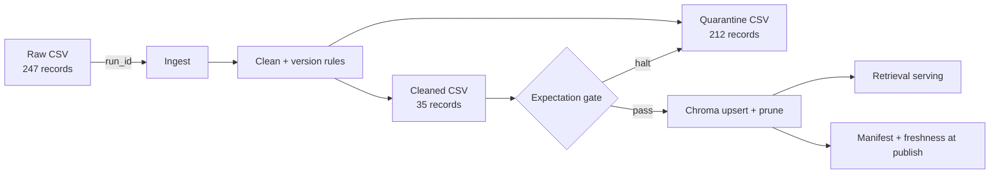

# Kiến trúc pipeline - Lab Day 10

**Nhóm:** Lab team
**Cập nhật:** 2026-06-10

## 1. Sơ đồ luồng

`run_id` xuất hiện trong log, manifest, tên cleaned/quarantine CSV và metadata vector.
Freshness được đo sau publish từ `latest_exported_at` trong manifest.

## 2. Ranh giới trách nhiệm

| Thành phần | Input | Output | Owner |
|---|---|---|---|
| Ingest | `data/raw/policy_export_dirty.csv` | danh sách raw rows | Data Engineering |
| Transform | raw rows + allowlist/version rules | cleaned + quarantine | Data Quality |
| Quality | cleaned rows | warn/halt results | Data Quality |
| Embed | cleaned CSV | snapshot collection `day10_kb` | AI Platform |
| Monitor | manifest | PASS/WARN/FAIL freshness | AI Platform |

## 3. Idempotency và rerun

Vector được `upsert` theo `chunk_id`; trước upsert, pipeline xóa mọi ID không còn trong snapshot cleaned.
Hai lần chạy cùng code giữ collection ở 35 vector, không tạo duplicate. Khi chuyển từ inject sang clean,
log ghi `embed_prune_removed=2`; khi alias retrieval đổi, snapshot mới prune đúng một ID cũ.

## 4. Liên hệ Day 09

Collection `day10_kb` là serving boundary cho retriever/agent. Day 09 có thể trỏ
`CHROMA_DB_PATH` và `CHROMA_COLLECTION` vào collection này để chỉ đọc corpus đã qua quality gate.

## 5. Rủi ro đã biết

- Snapshot mẫu có `latest_exported_at=2026-04-11`, nên freshness FAIL tại ngày chạy 2026-06-10.
- Alias retrieval hiện là rule theo domain; production nên quản lý synonym trong catalog có version.
- Allowlist cần được cập nhật đồng bộ với contract khi thêm nguồn canonical.
